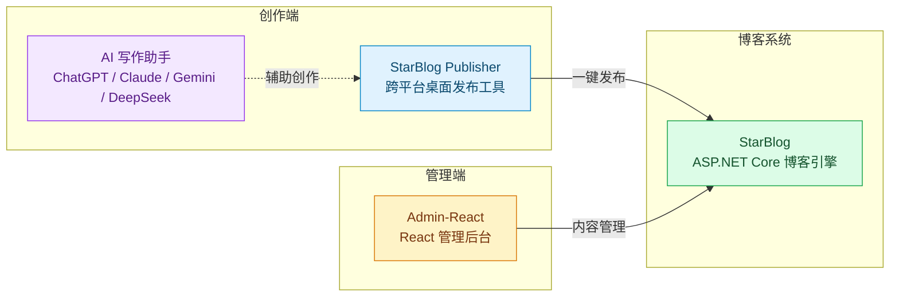

# StarBlog

**现代化博客生态系统 — 从写作到发布，一站式解决方案**

StarBlog 是一个围绕个人博客构建的完整工具链，涵盖博客系统、内容管理后台与跨平台发布工具，让创作者专注于内容本身。

---

## 生态架构

| 仓库 | 说明 | 技术栈 | Stars |
|------|------|--------|-------|
| [StarBlog](https://github.com/Deali-Axy/StarBlog) | 博客系统主仓库（ASP.NET Core） | C# / ASP.NET Core | — |
| [starblog-publisher](https://github.com/star-blog/starblog-publisher) | 跨平台 AI 驱动的 Markdown 发布工具 | C# / Avalonia / .NET 8 | ⭐ 24 |
| [Admin-React](https://github.com/star-blog/Admin-React) | React 管理后台 | TypeScript / Ant Design Pro | — |

---

## 项目详情

### StarBlog（博客系统）

StarBlog 生态的核心，基于 ASP.NET Core 构建的现代化博客系统。

🔗 主仓库：[github.com/Deali-Axy/StarBlog](https://github.com/Deali-Axy/StarBlog)

### StarBlog Publisher（发布工具）

专为 StarBlog 设计的跨平台桌面发布工具，告别传统打包上传：

- **即写即发** — Markdown 编辑、预览和发布一气呵成
- **自动图片处理** — 自动识别本地图片，上传至服务器并更新链接
- **AI 智能助手** — 内置 ChatGPT、Claude、Gemini、DeepSeek，提供标题润色、内容总结等辅助
- **跨平台** — 基于 Avalonia UI + .NET 8，支持 Windows / macOS / Linux
- **实时预览** — 所见即所得，确保发布效果符合预期
- **跨平台复制** — 一键复制格式化内容，方便同步到知乎、公众号等平台

### Admin-React（管理后台）

基于 Ant Design Pro 构建的 React 管理后台，提供博客内容的可视化管理界面。

---

## 技术栈

| 层 | 技术 |
|----|------|
| 博客系统 | ASP.NET Core / C# |
| 发布工具 | .NET 8 + Avalonia UI（AOT 编译） |
| 管理后台 | React + Ant Design Pro |
| AI 集成 | Microsoft.Extensions.AI（OpenAI / Claude / Gemini / DeepSeek） |

---

感谢关注 StarBlog 生态！
