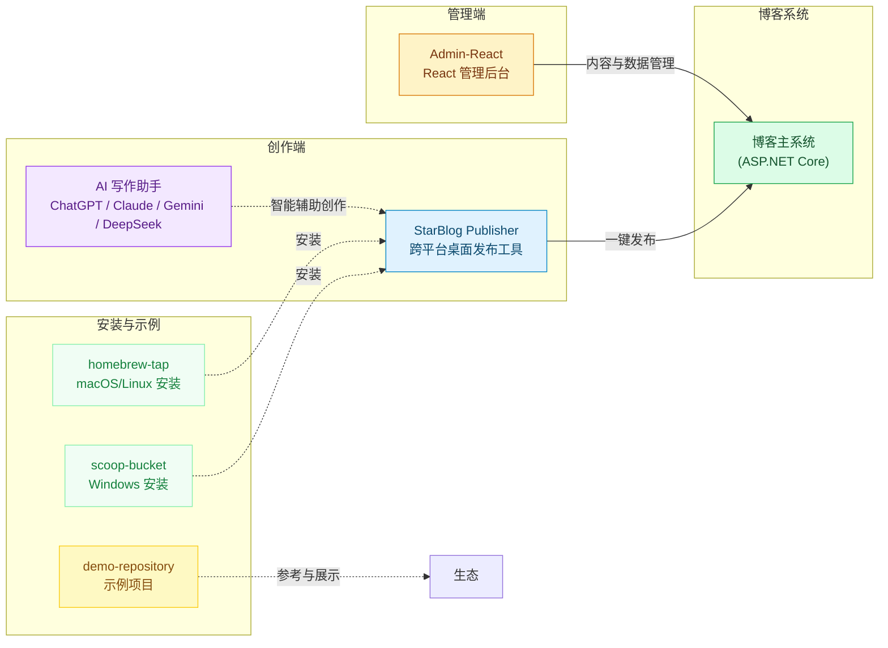

# StarBlog

**现代化博客生态系统 — 为创作者打造无缝、智能的写作与发布体验**

我们构建了一个完整的开源工具链，旨在帮助个人博客创作者专注于内容。从构思、AI 辅助创作，到高效的发布与管理，StarBlog 让整个创作流程变得轻松而愉悦。

---

## 生态架构

下图展示了 StarBlog 生态中各项目的核心关系与协作流程。它不仅包含核心的创作、管理与博客系统，也涵盖了用于便捷安装的包管理器仓库以及展示用的示例项目。

---

## 项目总览

以下是 StarBlog 生态中的核心开源项目：

| 项目 | 说明 | 语言 | Stars |
| :--- | :--- | :--- | :--- |
| [**StarBlog (主系统)**](https://github.com/Deali-Axy/StarBlog) | 生态核心，基于 ASP.NET Core 的现代化博客引擎。 | C# | — |
| [**starblog-publisher**](https://github.com/star-blog/starblog-publisher) | 跨平台 AI 驱动的 Markdown 文章发布工具。 | C# | ⭐ 26 |
| [**Admin-React**](https://github.com/star-blog/Admin-React) | 基于 React 和 Ant Design Pro 的博客管理后台。 | TypeScript | — |
| [**homebrew-tap**](https://github.com/star-blog/homebrew-tap) | 用于在 macOS/Linux 上通过 Homebrew 安装 StarBlog 工具。 | Ruby | — |
| [**scoop-bucket**](https://github.com/star-blog/scoop-bucket) | 用于在 Windows 上通过 Scoop 安装 StarBlog 工具。 | — | — |
| [**demo-repository**](https://github.com/star-blog/demo-repository) | 用于展示与测试的示例项目代码库。 | HTML | — |

---

## 项目详情

### StarBlog（主系统）
生态的核心与基石。一个使用 ASP.NET Core 构建的、功能完备的现代化博客系统，负责内容存储、用户访问和网站渲染。
🔗 **了解更多：[github.com/Deali-Axy/StarBlog](https://github.com/Deali-Axy/StarBlog)**

### StarBlog Publisher（发布工具）
一款为创作者打造的桌面利器，旨在革新博客发布的传统流程。
- **AI 深度集成**：内置主流大模型助手，提供标题优化、内容润色、摘要生成等智能辅助，激发创作灵感。
- **高效发布流**：Markdown 编辑、实时预览、一键发布，无缝衔接。
- **智能图片处理**：自动识别并上传本地图片至博客服务器，彻底解放你的双手。
- **跨平台体验**：基于 .NET 8 与 Avalonia UI 构建，原生支持 Windows、macOS 和 Linux。

### Admin-React（管理后台）
一个清晰、现代的博客管理界面，用于对文章、分类、标签等数据进行可视化操作与管理。
- **开箱即用**：基于成熟的 [Ant Design Pro](https://pro.ant.design/) 模板初始化，提供标准化的前端项目结构和组件。
- **高效开发**：支持 `npm start` 等便捷脚本，加速开发与调试流程。

### Homebrew Tap & Scoop Bucket（安装工具）
这两个仓库是 StarBlog 工具的官方包管理器仓库，为不同操作系统的用户提供了标准化、自动化的安装方式。
- **homebrew-tap**：面向 macOS 和 Linux 用户，通过 `brew` 命令即可轻松安装 StarBlog 工具。
- **scoop-bucket**：面向 Windows 用户，通过 `scoop` 命令实现一键安装。

### Demo Repository（示例项目）
一个专门设计的代码库，用于展示和测试 StarBlog 生态的最佳实践与功能。它为新用户或开发者提供了一个可以快速上手和参考的起点。

---

## 技术栈概览

| 层级 | 技术选型 |
| :--- | :--- |
| **博客系统** | ASP.NET Core / C# |
| **发布工具** | .NET 8 + Avalonia UI (AOT) |
| **管理后台** | React + Ant Design Pro |
| **AI 集成** | 支持主流大模型 API (ChatGPT, Claude, Gemini, DeepSeek 等) |
| **安装工具** | Homebrew (Ruby), Scoop |

---

我们致力于为创作者提供最佳的工具体验。欢迎探索各个项目，提出宝贵意见，或加入我们一起构建这个生态。